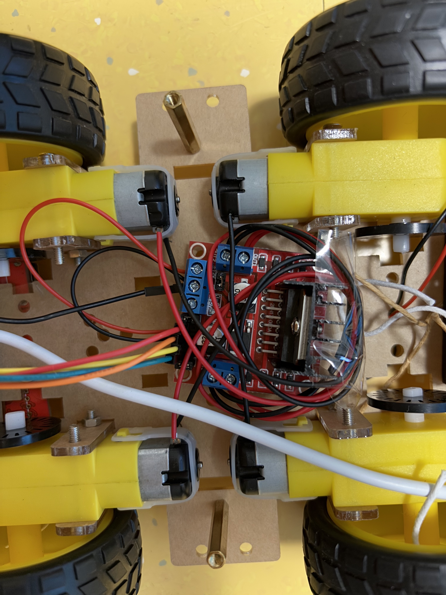
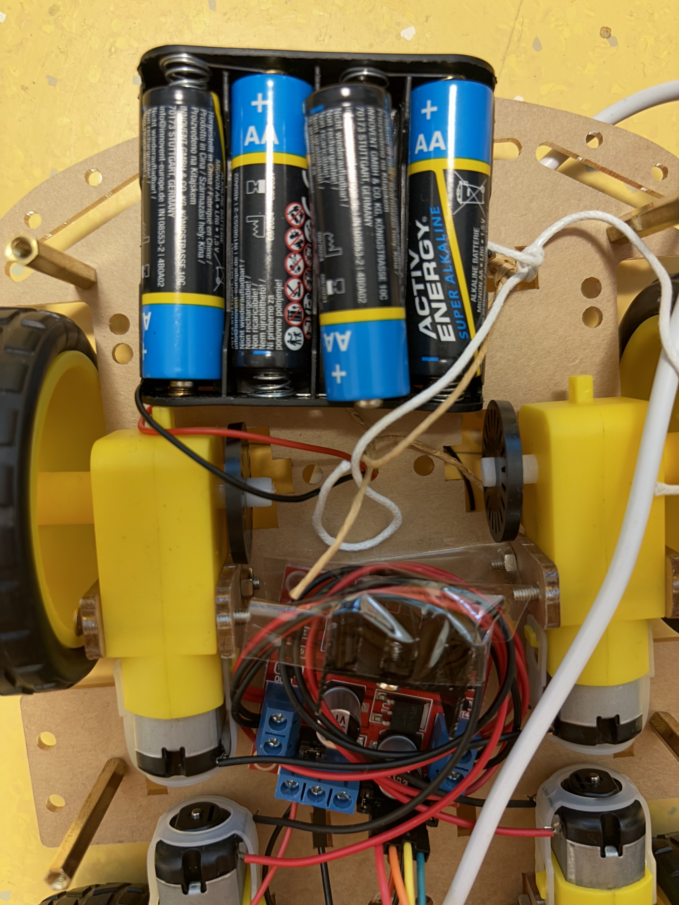

# Remote Car Puzzle Document

## Overview
This is an interactive remote control car project built with a Raspberry Pi, motors, camera, and sensors. The car is designed to navigate a maze, interact with physical objects, and solve challenges such as aligning QR code pieces to complete a task. It is controlled remotely through a web interface and communicates using MQTT protocol.

## Task description
The car's primary task is to navigate through a custom-built maze, locate a movable object with half of a QR code, and push the object to align it with the other half of the code positioned in the maze. Once aligned, the car uses its camera to scan the full QR code, verifying the solution.
Additional challenges and customizations can include:
- Varying maze difficulty
- Detecting multiple QR codes
- Time-based puzzle solving

## Set Up
### Install OS
- Install Raspberry Pi OS using the Raspberry Pi Imager.
- Enable SSH and Wi-Fi settings during imaging.

### Install Package
Run the following commands to update your system and install required Python packages:
```
sudo apt update
sudo apt install python3-picamera2 python3-lgpio python3-flask
```

### Clone the Repository
Clone the project from GitHub:
```
git clone git@github.com:litcpslab/floppiano.git
```

### Configure Environment Variables
Create a .env file inside the remote_car_puzzle directory:
```
MQTT_BROKER=TODO
MQTT_PORT=1883
MQTT_TOPIC_GENERAL=TODO
MQTT_TOPIC_POINTS=TODO
MQTT_USERNAME=TODO
MQTT_PASSWORD=TODO
```
Your .env file path should look like:
floppiano/remote_car_puzzle/.env

### Assemble the car
#### Components:
- Raspberry Pi 4 × 1
- Wheels × 4
- DC Motors × 4
- L298N H-Bridge Motor Driver × 1
- Battery Box (for AA batteries) × 1
- AA Batteries × 4
- Lithium Battery × 1
- Battery Management Board × 1
- Camera Module × 1
- Chassis Plates (Car Boards) × 2

#### Steps

- Connect Motors to Motor Driver and Raspberry Pi
  - Connect the two motors on the same side to Motor A outputs (OUT1 and OUT2).
  - Connect the other two motors to Motor B outputs (OUT3 and OUT4).
  - Solder the motor wires to prevent them from detaching during movement.



- Connect Battery Box to Motor Driver
  - Connect the red wire from the battery box to the motor driver's +12V input.
  - Connect the black wire to the motor driver's GND.



- Connect Motor Driver to Raspberry Pi GPIO

| Motor Driver Pin | Raspberry Pi GPIO | Raspberry Pi Physical Pin
| ------- | ------- | ------- |
| GND | GND | Pin 34
| Input 1 | GPIO 17 | Pin 11 |
| Input 2 | GPIO 22 | Pin 15 |
| Input 3 | GPIO 23 | Pin 16 |
| Input 4 | GPIO 24 | Pin 18 |


- Connect Lithium Battery to Raspberry Pi
    - Connect the lithium battery to the UPS board.
    - Connect the UPS board to the Raspberry Pi using either:
        - A USB Type-A to USB Type-C cable
        - Soldering the UPS board's output pins and connecting them to the Raspberry Pi using wires.


- Connect the Camera to Raspberry Pi
  - Connect the camera module to the CSI port on the Raspberry Pi.
  - Ensure the connection is correct and the ribbon cable is securely inserted.
  - Always connect the camera before booting the system.


- Mount All Components to the Chassis
    - Use screws to secure components to the car boards.
    - Use strings or zip ties as additional support to hold batteries, boards, or loose components in place.
- Charging the Lithium Battery
    - To charge the lithium battery, connect a USB Type-C charger to the UPS board.
    - The UPS board will handle charging and power delivery to the Raspberry Pi automatically.
    - Ensure the battery is connected to the UPS board before charging.

### Start the car
- Check Power Supply
    - Ensure all AA batteries are properly installed in the battery box.
    - Switch on the power supply on the UPS board to power the Raspberry Pi.
- MQTT Connection Required
    - The system will not start successfully if it cannot connect to the configured MQTT server.
    - Make sure your .env file is set up correctly and the MQTT broker is running.
- Start the Backend Server
```
cd remote_car_puzzle
python3 server.py
```
- Access the Web Interface
    - Open a web browser and go to: https://{raspberry-pi-ip}:5000
    - Replace <raspberry-pi-ip> with the actual IP address of your Raspberry Pi on the local network.

### Maze Setup
- Build the maze using cardboard or other available objects in the room.
- Ensure paths are wide enough for the car to move and push objects.
- Use tape or glue to keep the maze stable during movement.
- Feel free to adjust the difficulty of the maze based on your testing or preferences — make it as simple or challenging as you'd like.

### QR Code Puzzle
- Generate QR Codes
    - Use an online QR code generator to create three unique QR codes.
    - Print and cut each QR code in half vertically or horizontally.
- Prepare Puzzle Pieces
    - Attach one half of each QR code to a movable square object (e.g., a small box).
    - Fix the other half to a wall or surface inside the maze, aligned with the object's intended final position.
- Objective
    - The car must push the object so that the two halves of the QR code align correctly.
    - Once aligned, the car’s camera scans the full QR code to complete the puzzle.

## Reference
- UPS docs: https://github.com/rcdrones/UPSPACK_V3/blob/master/README_en.md
- Motor Driver: https://sharad-rawat.medium.com/interfacing-l298n-h-bridge-motor-driver-with-raspberry-pi-7fd5cb3fa8e3
